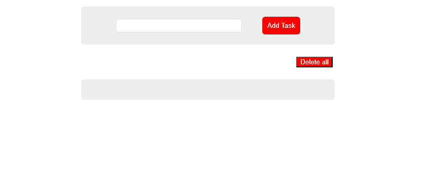

# 📝 To-Do List App (JavaScript)

A simple and interactive To-Do List application built using pure JavaScript.

👉 [View Project](https://sherift911.github.io/Todo-list-localstorage-JS/)

## 🚀 Features
- Add new tasks
- Delete individual tasks
- Delete all tasks
- Save tasks using Local Storage
- Tasks persist after page reload

## 🧠 How It Works
- Tasks are stored in an array
- Each task has:
  - id (unique باستخدام Date.now)
  - title
  - completed status
- البيانات بتتخزن في Local Storage باستخدام JSON

## 🛠️ Technologies Used
- HTML
- CSS
- JavaScript (Vanilla JS)
- Local Storage API

## 📂 Project Structure
